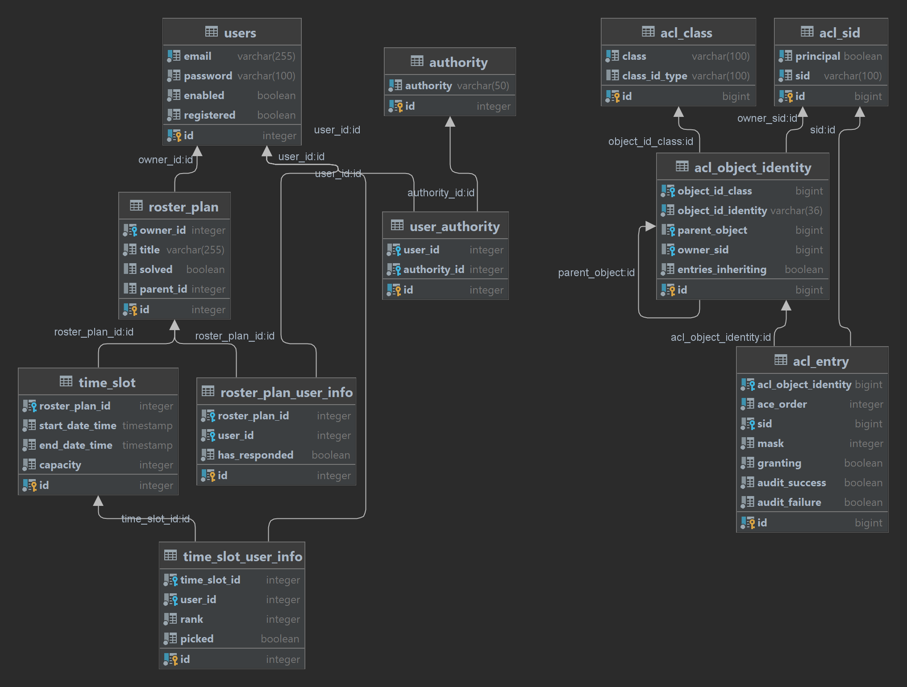

= WeMeet 0.3.0 Developer Guide
Marcus Xu;
:toc:

== Overview
Scheduling is a NP-hard problem. Essentially, our project provides a simple interface to CRUD a meeting (FE) / roster plan (BE) with some scheduling constraints, push it into the AI solver's task queue, and display them to the user for manual adjustments.

We chose Java, as our AI solver is JVM based. This means we stick to Java’s most common Spring Boot web framework. Throughout the project we aim to automate our development process as much as possible to reduce mistakes. at the cost of a higher learning curve than more beginner friendly tech stacks such as MEAN. For instance, for a typical CRUD operation,

* Most validation constraints are specified and automatically handled
* ACL checks are specified with `@PreAuthorize` and `@PostAuthorize`. Behind the scenes, Spring Security checks users permission with high performance cache. This is to be refined in later versions.
* The relevant CRUD API is automatically generated by Spring Data REST. Edge cases are handled with custom controllers and DTOs integrated with Spring HATEOAS.
HATEOAS stands for Hypermedia as the Engine of Application State. This provides a uniform and RESTful API by ensuring discoverability.
* We write extensive integration tests for the API.
* Then the documentation is generated from tests.


== Architecture
Standard monolith model.

. Client calls API
. Controller intercepts and validates request
. Forward request to service layer
. Service sends queries to repositories
. Controller formats response

== UI
.Pages
* Dashboard: Display the meetings that the current user manages and that invite current user. (Pending response is a misnomer)
* Home: Main page
* MeetingEdit: Edit the meeting that the current user manages. Use `Generate Roster` button to generate solution.
* MeetingRank: Provide rank preferences to time slots in meeting that invites current user
* MeetingViewSolution: View the solution generated from rank preferences. Publishing overwrites meeting allocations with those from the solution.

.File structure
* `components`
* `core`: Utilities and React Context
* `pages`: Routed by React Router. Assembled from components.
* `test`: Jest unit tests

== Repository

=== Schema design
Standard relational schema.

.Database schema


Note that `password` in the `users` table are `bcrypt` hashes. Associations are shown in the diagram and in code.

=== Choice of database
We chose PostgresSQL because it comes with Heroku. Definitely http://www.sarahmei.com/blog/2013/11/11/why-you-should-never-use-mongodb/[not MongoDB] though. Especially at our scale that's just premature optimization. Relational databases are easier to iterate since data duplication is avoided.

=== Choice of ORM
Spring Boot comes with Hibernate. Enough said.

== Tech stack
Check `package.json` for frontend libraries and `pom.xml` for backend libraries.

=== Frontend

==== React
We chose React since it helps with component reuse. And we both only know React for UI.

==== React Router
For routing.

==== Material UI
Provides most of the UI components.

==== Syncfusion
Provides scheduler and data grid component that send requests to backend whenever user manipulates them. Requires community license.

=== Backend

==== PostgresSQL
See above.

==== Spring Boot
An opinionated framework that configures Spring, the web application framework.

==== Spring Security
Handles authentication and access control checks.

==== OptaPlanner
AI Constraint solver. Generates solutions for meeting schedules given ranks.

==== Liquibase
Handles database migrations. Synchronize DB schemas among developers.

==== H2 Database
In memory database for integration tests.

==== Spring Data Rest
Generates RESTful API from repositories. Ensure API discoverability, uniformity and RESTfulness.

==== Spring Rest Docs
Generates the requests and responses from integration tests for API reference.

==== Miscellaneous
* Lombok: Generates boilerplate code like getters and setters.

== Client implementation
This is a high level view of how we implement our UI. This means we won't include details like

> Upon submission, the details entered by the user are sent to the backend server using an axios POST request.

=== Context store
We use React context to persist user information in browser cache, to avoid repeated calls to server.

=== Navigation
Handled by React Router. A navigation bar is provided for convenience. The avatar (changing which is to be implemented) opens a menu for profile related actions such as logging out.

=== Account management
The user clicks on "Get Started" and that opens a modal containing forms to log in or register. Then when user submits using buttons, `POST` requests are sent to different routes.

==== Registration
Server response is persisted in context store.

==== Login
Server response is persisted in context store.

==== Logout
Clears context store.

==== Forgot password
To be implemented.

=== Syncfusion integration
For Syncfusion components to work with our existing API, some glue code has to be written (which is the hard part). Once written,

First define the data source
```javascript
return new DataManager({
    adaptor: new RestAdaptor({
      GET: RestAdaptor.get(url, resp => resp._embedded.rosterPlan),
      POST: RestAdaptor.post(API.ROSTER_PLAN),
      PUT: RestAdaptor.put(API.ROSTER_PLAN),
      DELETE: RestAdaptor.delete(API.ROSTER_PLAN, ({ key }) => key)
    })
})
```

Then provide data source and fields
```javascript
<GridComponent
  dataSource={dataSource}
  editSettings={editSettings}
  toolbar={TOOLBAR}
>
  <ColumnsDirective>
    <ColumnDirective
      field='id' headerText='ID' template={linkIDTemplate}
      width='120' textAlign='Center' isPrimaryKey
      isIdentity
    />
    <ColumnDirective field='title' headerText='Title' textAlign='Center' />
  </ColumnsDirective>
  <Inject services={[Edit, Toolbar]} />
</GridComponent>
```

Done. CRUD operations are now fully integrated. You can use the UI to CRUD and results will be persisted in database. See `RestAdaptor.js` for glue code, which we will gladly share. This is still a work in progress, as paging, filtering and sorting are yet to be integrated.

=== Dashboard
Displays meetings managed by user and those that invite current user. Both tabs are handled by Syncfusion data grids and fully integrate with our API for CRUD actions.

Each item contains a hyperlink on the ID field which brings user to respective meeting management pages. This is implemented using Syncfusion's custom template feature.

=== Scheduling
There are three views: `Edit`, `Rank`, and `ViewSolution`. Each uses Syncfusion Scheduler component, but calls different API and have different access control checks (to be implemented).

* In `Edit` mode the user can CRUD time slots, invited users, meeting title and other configurations.
* In `Rank` mode the user can provide ranking preferences.
* In `ViewSolution` mode the user can view results and publish them. More details are provided below.

Under the hood, the scheduler fully integrates with our API (as described above). Custom editor UI for time slots are also provided and integrated (as described above).

=== Server implementation

=== Security
Handled by Spring Security. Session is persisted through cookies. CSRF protection is enabled, so the token is refreshed per request. Validation is for now only done server side.

In addition, we have set up a firewall to deny unauthenticated users most API calls. Access control checks will likely be in next release.

==== Registration
Once server receives `POST` request to `/api/users` route, we validate and persist user details into the database. Password is `bcrypt` hashed.

==== Login
Handled by Spring Security.

==== Logout
Handled by Spring Security.

==== Forgot password
To be implemented.
