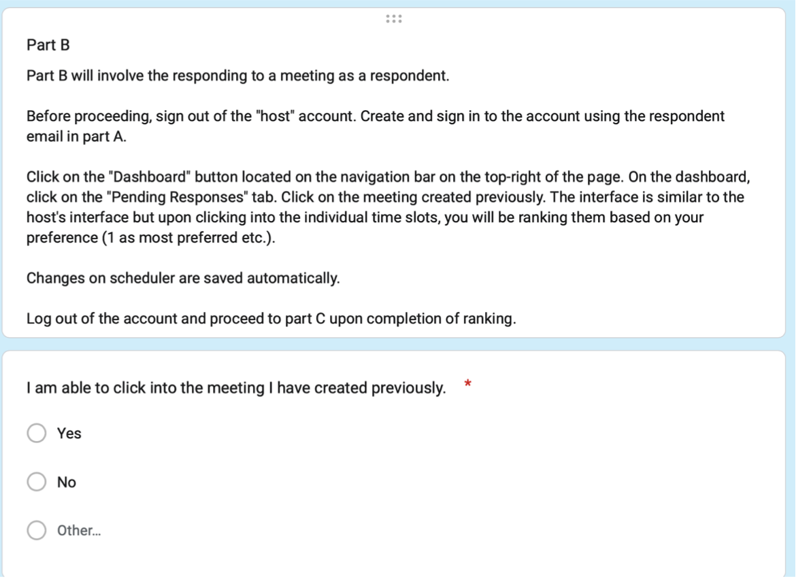

= WeMeet 0.3.0 Testing Guide
Marcus Xu;
:toc:

Refer to source code for latest tests. Our test coverage currently has much room for improvement. This document is primarily for Orbital requirement.

== Unit testing

=== Dashboard
* Without error, grid renders as specified in snapshot.
* With error, grid renders as specified in snapshot and renders error message.

=== Event Grid
* Without data, grid renders as specified in snapshot and renders no data.
* With data, grid renders as specified in snapshot and renders data.

=== Pending Response Grid
* Without data, grid renders as specified in snapshot and renders no data.
* With data, grid renders as specified in snapshot and renders data.
** If owner is same as current user renders 'Yourself'
** Otherwise renders owner's email.

=== Navigation bar
* Renders as specified in snapshot.

=== Scheduler

.Appearance of time slots
* Without data, renders as specified in snapshot and renders correct description.
* With single datum, renders as specified in snapshot and renders correct description.
* With multiple entries, renders as specified in snapshot and renders correct description.

.Edit view
* Without data, renders as specified in snapshot.
* With data, renders as specified in snapshot. (Failed to implement, to be tested in system testing for now)
* Editor component
** Without data, renders as specified in snapshot.
** With user picks (mocked, assumed provided by server), renders as specified in snapshot.
** With solver allocations (mocked, assumed provided by server), renders as specified in snapshot.

.Rank view
** Without data, renders as specified in snapshot.
** With data, renders as specified in snapshot. (Failed to implement, to be tested in system testing for now)
** Editor component
*** Without data, renders as specified in snapshot.
*** With ranks provided by current user (mocked, assumed provided by server), renders as specified in snapshot.
*** With ranks not provided by current user (mocked, assumed provided by server), renders as specified in snapshot.

== Integration testing
We tested out the following API for backend.

=== User
.Creation
* Given request with invalid email, when client `POST`, then server responds with `400 Bad Request`.
* Given request with invalid password of length less than 8, when client `POST`, then server responds with `400 Bad Request`.
* Given valid request, when client `POST`, then a user is created.
* Given valid request and existing unregistered user, when client `POST`, then a user is registered.
* Given valid request and existing registered user, when client `POST`, then server responds with `400 Bad Request`.

.Read
* Given anonymous user, when client `GET /api/users/me`, then server redirects to login page.
* Given authenticated user, when client `GET /api/users/me`, then server responds with `200 OK` with the correct user information.

=== Meeting
.Creation
* Given valid request, when client `POST`, then an empty meeting is created.
* Given invalid request, when client `POST`, then server responds with `400 Bad Request`.
* Given anonymous user, when client `POST`, then server redirects to login page.

.Update
* User info for meeting
** Given new user, when owner of a meeting invites user, then the new user can read meeting data.
** Given new user, when owner of a meeting does not invite user, then the new user cannot read meeting data. (Failed, as ACL checks are disabled until v0.4.0)
** Given valid email, when owner of a meeting `POST`, then an unregistered user is persisted in the server database.
* Time slots
** Given valid request, when client `POST`, then a time slot is created for the meeting.
** Given valid request, when client `POST`, then an invited user can also read the time slot data.
** Given invalid request, when client `POST`, then server responds with `400 Bad Request`.
* User info for time slots
** Given valid request and existing time slot, when an invited user ranks one's preference, then server responds with `200 OK`.

=== Solution
.Creation
* Given valid request, when client `POST`, then solver starts running.
** Before solver terminates, when client `GET`, then server responds with `200 OK` with `solved` set to `false`
** After solver terminates, when client `GET`, then server responds with `200 OK` with `solved` set to `true` and response contains valid solution.
* Given valid request, when client `POST /api/rosterPlan/publish`, then server responds with `200 OK` and overrides original `rosterPlan`.

== System testing
TODO

== User testing
=== Google Form Link for User Testing

https://forms.gle/mv4PmppxTaHfbwBq6[https://forms.gle/mv4PmppxTaHfbwBq6]

=== Methodology

Testing will be done with a  Google Form which systematically guides the user through each feature of WeMeet while collecting their comments. As WeMeet is meant to be a general scheduling platform, we will be doing our user testing on the general public. Emails and text messages with the user testing link were sent to friends and family. We will be conducting one round of internal testing followed by 3 rounds of user testing. As testing rounds occur, we will also be refining the features of WeMeet and making small additions to the user testing form to include them. Email addresses of respondents are collected to ensure all responses collected are legitimate.

=== Testing Process

Within the Google Form, users will follow action based instruction and conduct testing in the following sections:

. General web page navigation
. Account registration and authentication
. Scheduler functionality
. Overall feedback

=== Sample of User Testing Question

=== Rationale

This approach of a guided Google Form allows us to systematically test every feature of WeMeet and gather feedback. By having it online and done at the respondent’s convenience, we are able to avoid costs associated with physical user testing sessions which may not provide additional useful information. With the comprehensive user testing process, we aim to collect comprehensive feedback on the functionality and design of WeMeet.

=== Timeline

11th - 14th July: First round  +
15th - 18th July: Second round  +
19th - 22nd July: Third round
Analysing, adapting to feedback will happen as a manner of continuous deployment. This approach takes inspiration from the Design Thinking Methodology : Create, Test, Improve, Iterate.