= WeMeet 0.3.0 User's Guide
Tan Jun Wei;
:toc:

== User Authentication

An account is required to access WeMeet’s features. A prompt to log in will appear if authentication is needed to access a particular page.

To access the sign up/log in modal, simply click on the empty avatar or the “Start Now” button on the top right of any page.

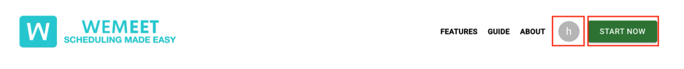

=== Creating an account +
Fill in your _First Name, Last Name, Email Address and Password_ to sign up for an account. +
From the sign up modal, you are also able to switch to the sign in option by clicking on _“Already have an account? Sign In”._

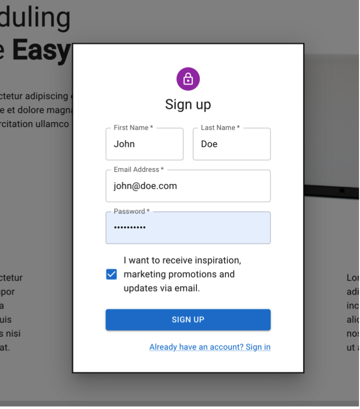

=== Logging into your account

Fill in your _Email address and password to sign in_. +
From the sign up modal, you are also able to switch to the sign up option by clicking on _“Don’t have an account? Sign Up”._

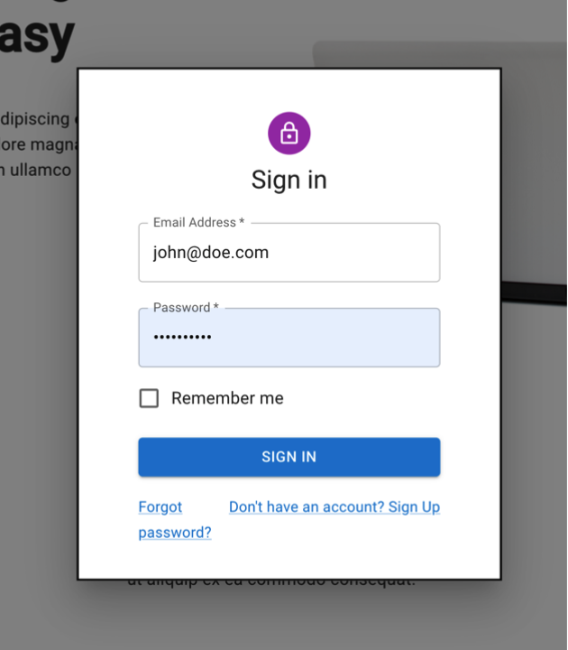

== Scheduler
To start using the scheduler, navigate to the dashboard page. You have to be logged in to access the page.

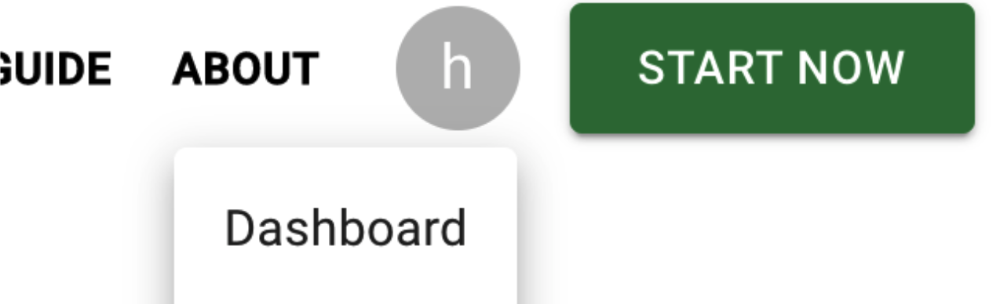

=== Creating a Meeting
From the dashboard, click on the "add" button to create a meeting.
Enter the meeting title in the text field and click into the meeting once it is created.

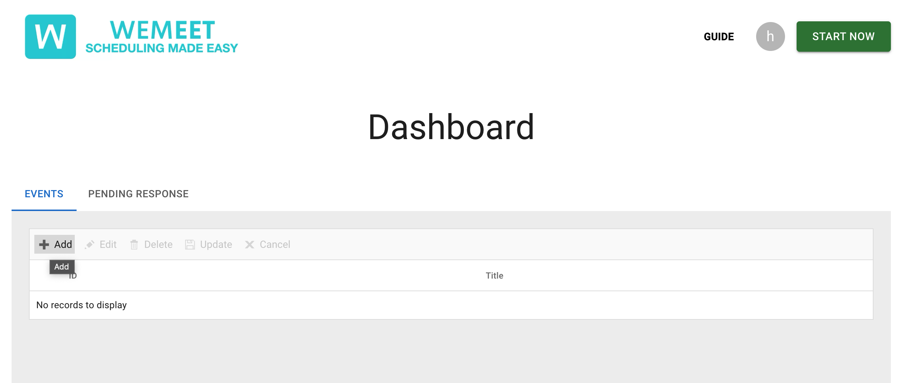
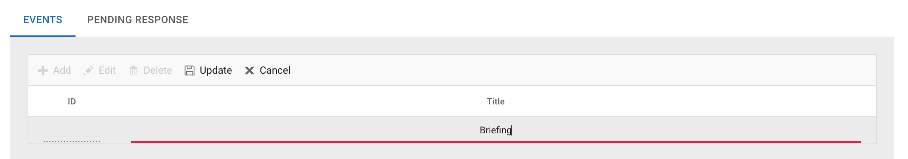
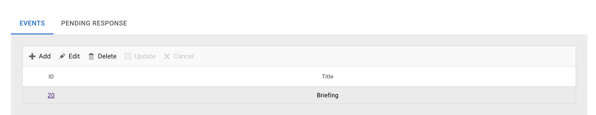

In the meeting's page, you can click on time slots to add a capacity.

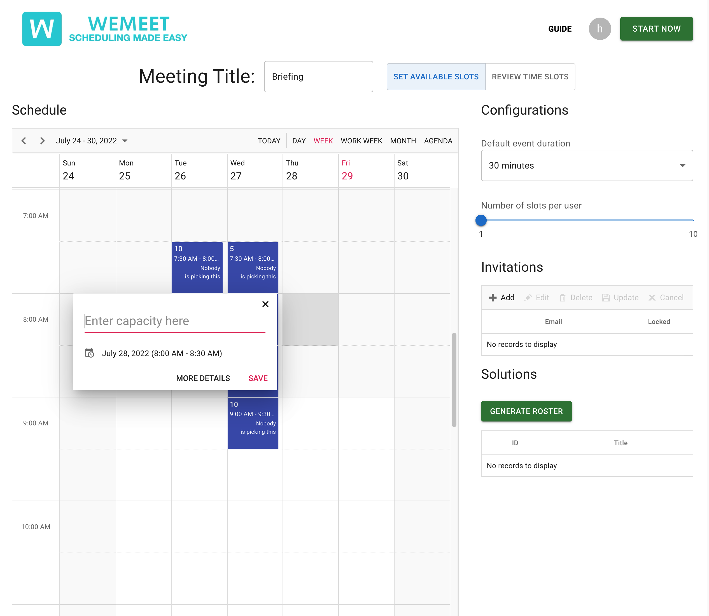

On the right of the page is the Invitations and Generate Roster button.
Enter the emails of the respondents in the invitations menu and they will be able to respond
with their availability. When the respondents have responded, click on "Generate Roster" to view the results.

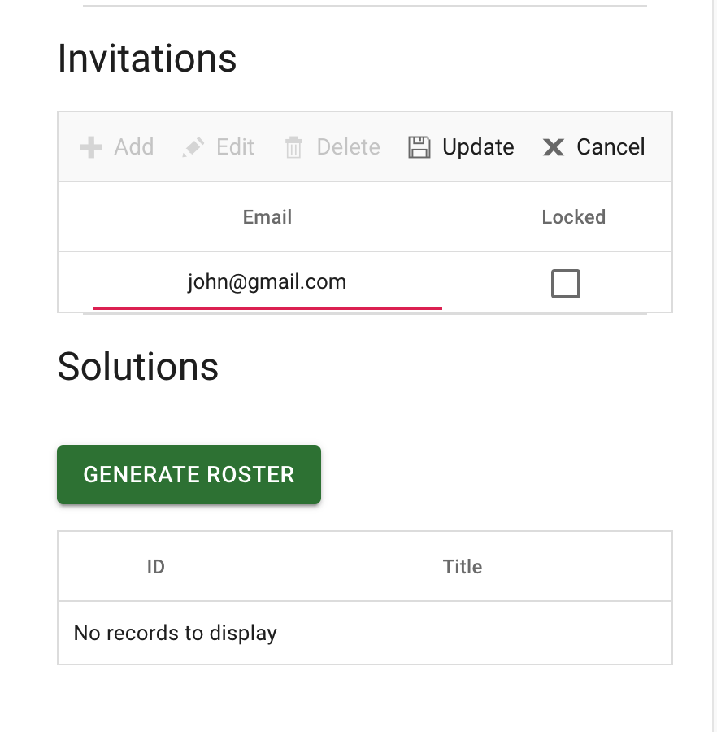

=== Responding to a Meeting

After being invited to a meeting, you will find it in your dashboard under "Pending Response".
Click on the meeting to view the details.

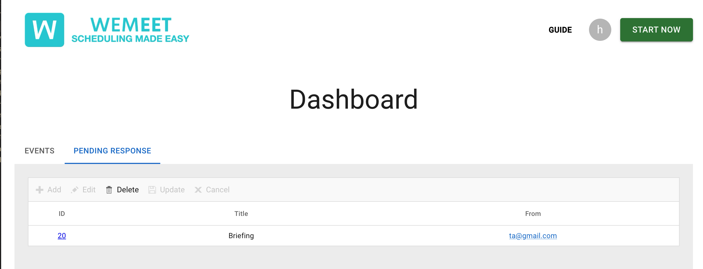

Select as many or as few time slots and indicate your preference.

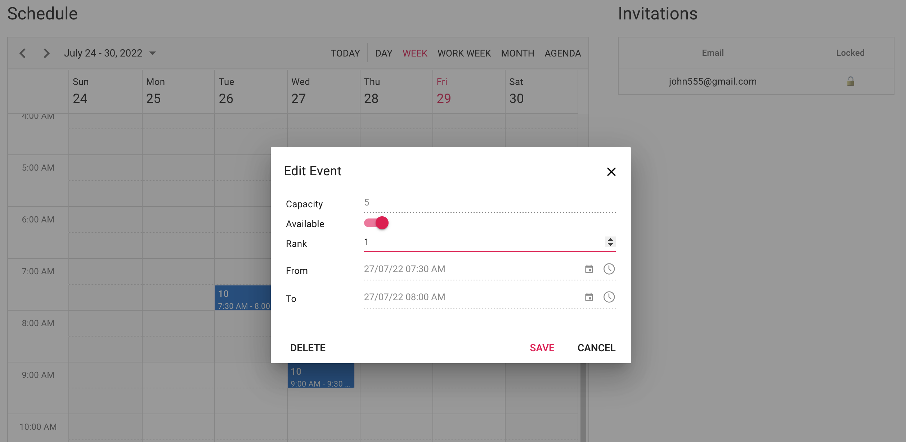

All results are saved automatically.

=== Generating a Roster

Once your respondents are done, click on the "Generate Roster" button and a roster will be generated.
The participant allocated to each time slot will be shown.

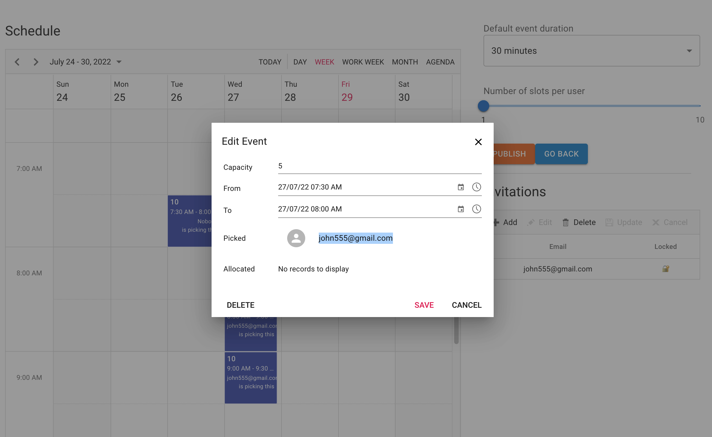

You may re-generate in the future and the new roster will be based on the updated responses (if any).
Old rosters will still be available for reference.

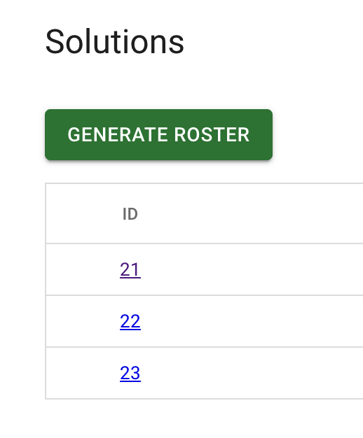
